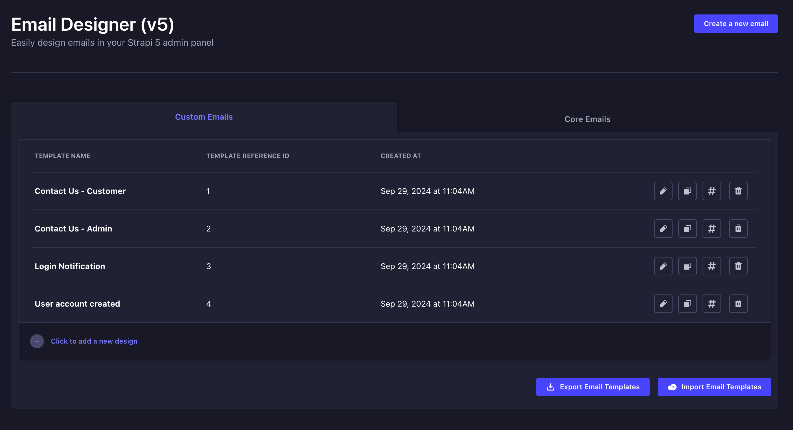

#  Strapi Email Designer (v5)

Design your own email templates directly from the Strapi admin panel and use the magic to send programmatically email from your controllers / services.


- [ Strapi Email Designer (v5)](#-strapi-email-designer-v5)
  - [❤️ Credits](#️-credits)
  - [💸 Support Me](#-support-me)
  - [⚙️ Version](#️-version)
  - [✅ Prerequisites](#-prerequisites)
  - [⬇️ Installation](#️-installation)
  - [🎚️ Middleware Configuration](#️-middleware-configuration)
  - [🎚️ Plugin Configuration](#️-plugin-configuration)
    - [📧 Nodemailer](#-nodemailer)
    - [⚙️ Default configuration](#️-default-configuration)
  - [▶️ Usage](#️-usage)
    - [✅ Creating a new design](#-creating-a-new-design)
    - [✅ Importing a design](#-importing-a-design)
    - [✅ Exporting a design](#-exporting-a-design)
    - [✅ Importing a Single Design](#-importing-a-single-design)
    - [✅ Saving a design](#-saving-a-design)
  - [{ } Mustache](#--mustache)
  - [💻 Programmatically Sending Emails](#-programmatically-sending-emails)
  - [🚀 Available Services](#-available-services)
    - [✅ Email Services](#-email-services)
      - [`sendTemplatedEmail`](#sendtemplatedemail)
      - [`compose`](#compose)
  - [🛟 Contributing](#-contributing)
  - [✍🏽 License](#-license)
  - [🎆 Images](#-images)

## ❤️ Credits

Special thanks to:

- [Unlayer](https://unlayer.com/) for the amazing email editor
- [Strapi Plugin Email Designer](https://github.com/alexzaganelli/strapi-plugin-email-designer) for doing the heavy lifting for v3 and v4

## 💸 Support Me

If you can 😊

<a href="https://buymeacoffee.com/llehXIrI8g" target="_blank"></a>

## ⚙️ Version

This plugin is compatible with Strapi v5.

How plugins are structured in v5 is way different than v4, so I am not trying to make this plugin compatible with v4. Use the [Email Designer plugin here](https://github.com/alexzaganelli/strapi-plugin-email-designer) for v4.

## ✅ Prerequisites

- Node v18+ (I recommend using [nvm](https://github.com/nvm-sh/nvm), there is a windows and mac/linux version)
- A Strapi v5 project (`npx create-strapi-app@latest my-project`)

## ⬇️ Installation

Install the plugin by runnig the following command:

```bash
npm install strapi-plugin-email-designer-v5
```

## 🎚️ Middleware Configuration

By default, Strapi's security is tight. You will need to add the following to your `config/middleware.ts` file:

```ts
{
  name: "strapi::security",
  config: {
    contentSecurityPolicy: {
      useDefaults: true,
      directives: {
        "script-src": ["'self'", "'unsafe-inline'", "editor.unlayer.com"],
        "frame-src": ["'self'", "editor.unlayer.com"],
        upgradeInsecureRequests: null,
      },
    },
  },
}
```

Ensure that you replace the `"strapi::security"` line in the file with the above.

## 🎚️ Plugin Configuration

The plugin configuration accepts most of the properties that can be passed to the Unlayer editor. You can get more information about them here: https://docs.unlayer.com/docs/getting-started#configuration-options

This is the type definition for the configuration:

```ts
import type { EmailEditorProps } from "react-email-editor";

export type EmailConfig = Pick<
  NonNullable<EmailEditorProps["options"]>,
  | "projectId"
  | "locale"
  | "appearance"
  | "user"
  | "mergeTags"
  | "designTags"
  | "specialLinks"
  | "tools"
  | "blocks"
  | "fonts"
  | "safeHtml"
  | "customCSS"
  | "customJS"
  | "textDirection"
>;
```

### 📧 Nodemailer

If you are going to send emails from the Strapi backend, you need to configure the email plugin. You can visit the docs [here](https://github.com/strapi/strapi/tree/main/packages/providers/email-nodemailer) to learn more

```bash
npm install @strapi/provider-email-nodemailer --save
```

### ⚙️ Default configuration

Some options are passed by default to the editor. Expand the following object to see the default configuration:

<details>
<summary style="font-weight: bold">Default configuration</summary>

```ts
{
  mergeTagsConfig: {
    autocompleteTriggerChar: "@",
    sort: false,
    delimiter: ["{{", "}}"],
  },
  appearance: {
    theme: "modern_light",
  },
  fonts: {
    showDefaultFonts: false,
  },
  tools: {
    image: {
      properties: {
        src: {
          value: {
            url: "https://picsum.photos/600/350",
          },
        },
      },
    },
  },
  mergeTags: {
    core: {
      name: "Core",
      mergeTags: {
        // Values that can be used in the Reset Password context
        resetPassword: {
          name: "Reset Password",
          mergeTags: {
            // User in the Reset Password context
            user: {
              name: "USER",
              mergeTags: {
                username: {
                  name: "Username",
                  value: "{{= USER.username }}",
                  sample: "john_doe",
                },
                email: {
                  name: "Email",
                  value: "{{= USER.email }}",
                  sample: "johndoe@example.com",
                },
              },
            },
            token: {
              name: "TOKEN",
              value: "{{= TOKEN }}",
              sample: "corresponds-to-the-token-generated-to-be-able-to-reset-the-password",
            },
            url: {
              name: "URL",
              value: "{{= URL }}",
              sample: "is-the-link-where-the-user-will-be-redirected-after-clicking-on-it-in-the-email",
            },
            serverUrl: {
              name: "SERVER_URL",
              value: "{{= SERVER_URL }}",
              sample: "is-the-absolute-server-url-(configured-in-server-configuration)",
            },
          },
        },
        // Values that can be used in the Email Addres Confirmation context
        addressConfirmation: {
          name: "Confirm Address",
          mergeTags: {
            // User in the Email Address Confirmation context
            user: {
              name: "USER",
              mergeTags: {
                username: {
                  name: "Username",
                  value: "{{= USER.username }}",
                  sample: "john_doe",
                },
                email: {
                  name: "Email",
                  value: "{{= USER.email }}",
                  sample: "johndoe@example.com",
                },
              },
            },
            code: {
              name: "CODE",
              value: "{{= CODE }}",
              sample: "corresponds-to-the-CODE-generated-to-be-able-confirm-the-user-email",
            },
            url: {
              name: "URL",
              value: "{{= URL }}",
              sample:
                "is-the-Strapi-backend-URL-that-confirms-the-code-(by-default-/auth/email-confirmation)",
            },
            serverUrl: {
              name: "SERVER_URL",
              value: "{{= SERVER_URL }}",
              sample: "is-the-absolute-server-url-(configured-in-server-configuration)",
            },
          },
        },
      },
    },
    mustache: {
      name: "Mustache",
      mergeTags: {
        basic: {
          name: "Basic Output",
          mergeTags: {
            raw: {
              name: "Display Raw Content",
              value: "{{{REPLACE_ME}}}",
            },
            output: {
              name: "Regular Output",
              value: "{{REPLACE_ME}}",
            },
            dottedOutput: {
              name: "Dot notation for Output",
              value: "{{REPLACE_ME.NESTED_VALUE}}",
            },
          },
        },
        loops: {
          name: "Loops",
          mergeTags: {
            raw: {
              name: "Display Raw Content in Loop",
              value: "{{#ARRAY_OR_OBJECT_TO_ITERATE}}\n{{{REPLACE_ME}}}\n{{/ARRAY_OR_OBJECT_TO_ITERATE}}",
            },
            output: {
              name: "Regular Output in Loop",
              value: "{{#ARRAY_OR_OBJECT_TO_ITERATE}}\n{{REPLACE_ME}}\n{{/ARRAY_OR_OBJECT_TO_ITERATE}}",
            },
            dottedOutput: {
              name: "Dot notation for Output in Loop",
              value:
                "{{#ARRAY_OR_OBJECT_TO_ITERATE}}\n{{REPLACE_ME.NESTED_VALUE}}\n{{/ARRAY_OR_OBJECT_TO_ITERATE}}",
            },
          },
        },
      },
    },
  },
}
```

</details>

<br/>

If you wish to pass in any configuration, you can do so in the `config/plugins.ts` file. Here is an example of how to pass in a custom configuration:

```ts
// You can import the EmailConfig type from the plugin
import type { EmailConfig } from "strapi-plugin-email-designer-5/dist/server/src";

export default ({ env }) => ({
  // You need Email configured if you are gonna send emails from the Strapi backend
  // This is a simple configuration for development using MailDev
  email: {
    config: {
      provider: "nodemailer",
      providerOptions: {
        host: "0.0.0.0",
        port: 1025,
        ignoreTLS: true,
      },
    },
  },
  // This is the configuration for the Email Designer plugin
  "email-designer-5": {
    enabled: true,
    // Your custom configuration here
    config: {
      // Here the Merge Tags defined will be merged with the defaults above
      mergeTags: {
        company: {
          name: "Company",
          mergeTags: {
            name: {
              name: "Company Name",
              value: "ACME Corp",
              sample: "ACME Corp",
            },
          },
        },
      },
    } as EmailConfig,
  },
});
```

## ▶️ Usage

After installing & configuring your app for the plugin, you can access the email designer by navigating to the `Email Designer (v5)` section in the admin panel.



### ✅ Creating a new design

Click on the `Create a new email` button to start a new design.

### ✅ Importing a design

You can import a set of designs that were exported by the platform by clicking on the `Import Email Templates` button located at the bottom right of the page.

### ✅ Exporting a design

You can export all your designs by clicking the `Export Email Templates` button located at the bottom right of the page.

### ✅ Importing a Single Design

When you start a new design, a button will be located in the top right called `Import` that allows you to import a single design. If the json file is valid Unlayer exported design, it will be imported into the editor.

### ✅ Saving a design

Once you are done editing your design, you can click on the `Save` button located at the top right of the page. The `Template Reference ID`, `Template Name`, & `Subject` fields are required to save the design.(Well not the last two lol)

The `Template Reference ID` is a unique identifier for the design. It is used to reference the design when sending emails programmatically.

## { } Mustache

The backend uses Mustache to render the templates. You can visit the [Mustache documentation](https://mustache.github.io/mustache.5.html) to learn more about how to use it.

## 💻 Programmatically Sending Emails

You can send emails programmatically by using the `email-designer-5` plugin. Here is an example of how to send an email:

> [!IMPORTANT]  
> This is tested the `index.ts` file of the `src` folder of my strapi project.

```ts
// import type { Core } from '@strapi/strapi';

export default {
  /**
   * An asynchronous register function that runs before
   * your application is initialized.
   *
   * This gives you an opportunity to extend code.
   */
  register(/* { strapi }: { strapi: Core.Strapi } */) {},

  /**
   * An asynchronous bootstrap function that runs before
   * your application gets started.
   *
   * This gives you an opportunity to set up your data model,
   * run jobs, or perform some special logic.
   */
  async bootstrap(/* { strapi }: { strapi: Core.Strapi } */) {
    try {
      await strapi
        .plugin("email-designer-5")
        .service("email")
        .sendTemplatedEmail(
          {
            // required
            // This can also be an array of email addresses
            to: "to@example.com",
            // Optional
            cc: ["zez@jakce.ad", "ilez@gevcanuso.la"],
            // Optional
            bcc: ["fud@darfuv.py"],
            // optional if /config/plugins.js -> email.settings.defaultFrom is set
            from: "from@example.com",
            // optional if /config/plugins.js -> email.settings.defaultReplyTo is set
            replyTo: "reply@example.com",
            // optional array of files
            attachments: [],
          },
          {
            // required - Ref ID defined in the template designer (won't change on import)
            templateReferenceId: 20,
            // If provided here will override the template's subject.
            // Can include variables like `Thank you for your order {{= USER.firstName }}!`
            subject: `Thank you for your order`,
          },
          {
            // this object must include all variables you're using in your email template
            USER: { firstName: "John", lastName: "Doe" },
            order: {
              products: [
                { name: "Article 1", price: 9.99 },
                { name: "Article 2", price: 5.55 },
              ],
            },
            shippingCost: 5,
            total: 20.54,
          }
        );
      strapi.log.info("Email sent");
    } catch (error) {
      strapi.log.error(error);
    }
  },
};
```

This is what the email looked like in the MailDev client


## 🚀 Available Services

Here is a list of the services that the plugin provides. You can call upon them in your controllers or services(or wherever you want).

### ✅ Email Services

#### `sendTemplatedEmail`

You will probably use this one a lot.

```ts
await strapi
  .plugin("email-designer-5")
  .service("email")
  .sendTemplatedEmail(EMAIL_OPTIONS_OBJECT, EMAIL_TEMPLATE_OBJECT, DATA);
```

#### `compose`

I didn't get why this service was deprecated in the original plugin, but i found it useful for sending PDF data to my frontend.

```ts
await strapi.plugin("email-designer-5").service("email").compose({ templateReferenceId, data });
```

This returns the email HTML and Text with the data merged.

```ts
{
  html: "<html>...</html>",
  text: "..."
}
```

## 🛟 Contributing

I am SUPER new to React. I have been using Nuxt all my life. If you see where I could have done something better in the admin area, please let me know. I am open to suggestions.

Just fork the repo, make your changes, and submit a PR. I will review it as soon as I can. I am open to learning new things.

## ✍🏽 License

MIT

I mean, I am not the original author of the plugin. I just made it compatible with Strapi v5. So, I am not sure if I can license it. But, I will keep it MIT for now.

## 🎆 Images

Image of the Core Tab in the Admin UI


Image of the Custom Email Tab in the Admin UI


Image of the Editor wit imported design


Image of Email in MailDev


